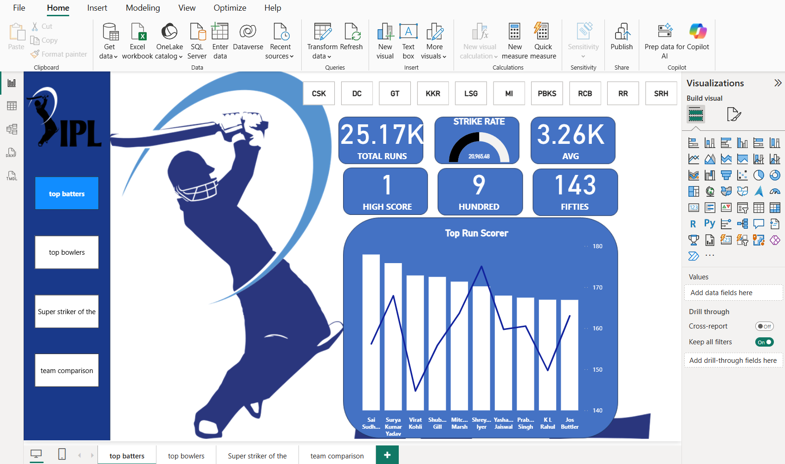
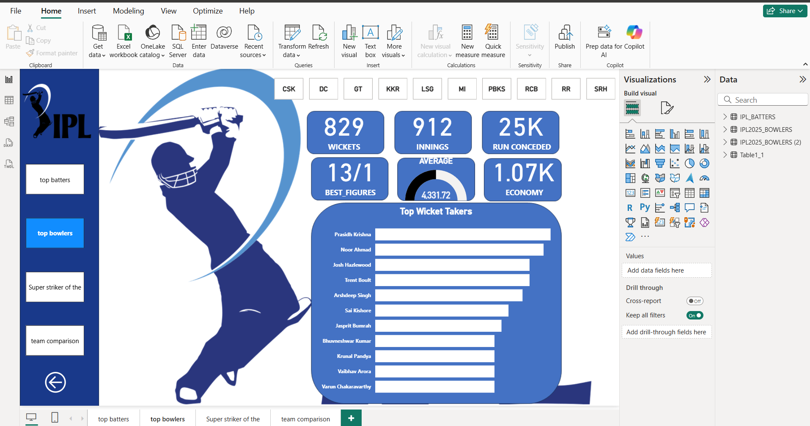
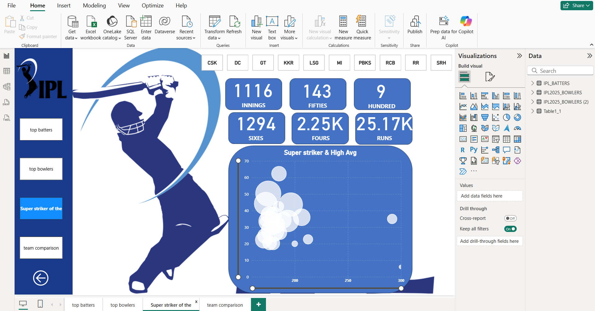
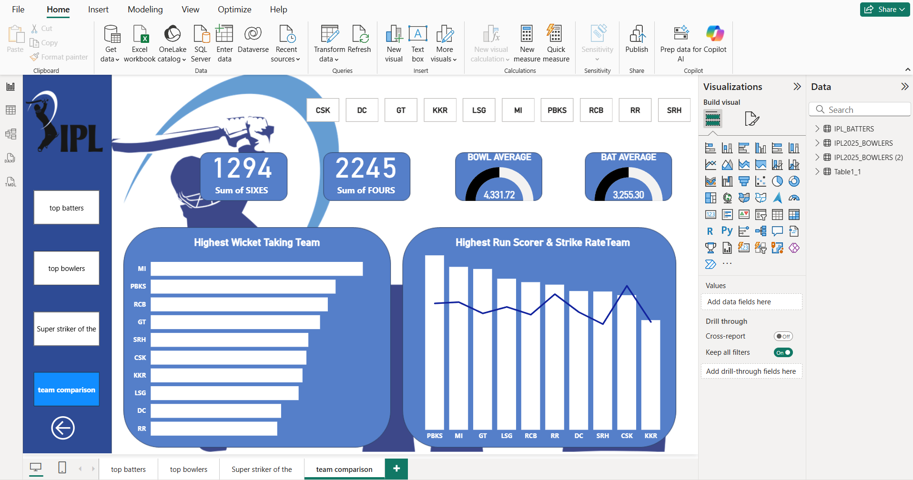

# 🏏 IPL Power BI Dashboard Project

This project presents an interactive dashboard analyzing Indian Premier League (IPL) data using **Power BI**. It extracts meaningful insights from match and player data, offering a rich visual experience to understand performance trends across teams and players.

---
## 📁 Files in This Repository

| File / Folder | Description |
|---------------|-------------|
| `ipl (1).pbix` | Main Power BI project file |
| `images/`      | Exported visuals and dashboard screenshots |
| `README.md`    | Project documentation |

---
## 🎯 Project Objective

The goal of this project is to perform data analysis and visualization on IPL datasets to identify key trends, top-performing players, and team statistics over multiple seasons.

---

## 📊 Data Pipeline & Architecture

This project follows a structured data engineering and visualization flow:

1. **📥 Data Collection**  
   - IPL datasets were sourced from [Kaggle](https://www.kaggle.com/), including match summaries, player stats, and ball-by-ball data.

2. **☁️ Cloud Storage (AWS S3)**  
   - The raw `.csv` files were stored in an **Amazon S3** bucket for secure, scalable storage.

3. **❄️ Data Warehouse (Snowflake)**  
   - The S3 bucket was connected to **Snowflake**, where data was cleaned, transformed, and pre-aggregated using SQL queries.

4. **🔌 Data Connectivity**  
   - The refined datasets were connected to **Power BI Desktop** using an appropriate connector or import process.

5. **📊 Dashboard Visualization**  
   - Visualizations were designed using Power BI's interactive features to showcase stats like top batters, wicket takers, strike rates, team comparisons, etc.

---

## 🧩 Project Workflow: Step-by-Step Breakdown

### 1. **Data Collection**
- Collected match-level, player-level, and ball-by-ball data from Kaggle.
  
### 2. **Data Cleaning & Preparation**
- Used Snowflake to clean column names, remove nulls, and create relations.
- Ensured team and player names were standardized.

### 3. **Data Modeling**
- Built a star schema with fact tables (matches, deliveries) and dimension tables (teams, players, seasons).
- Created DAX measures for runs, wickets, averages, strike rates, etc.

### 4. **Dashboard Design**
- Created four main pages:
  - **Top Batters**
  - **Top Bowlers**
  - **Super Striker & High Average**
  - **Team Comparison**

### 5. **Visualization Tools Used**
- Bar charts, line charts, donut charts, KPI cards, slicers, and bubble charts.
- Enabled cross-filtering and drill-through for interactivity.

### 6. **Key Insights**
- Players with high strike rates often also have high average scores.
- Certain teams consistently take more wickets and hit more sixes.
- Some venues favor chasing teams based on toss decisions and outcomes.

---

## 🖼️ Sample Visualizations

> _Screenshots below exported from the Power BI report:_

### 🔹 Top Batters  


### 🔹 Top Bowlers  


### 🔹 Super Striker & High Average  


### 🔹 Team Comparison  


---

## 🛠️ How to Use This Project

1. **Clone the Repository**
   ```bash
   git clone https://github.com/yourusername/ipl-powerbi-dashboard.git
